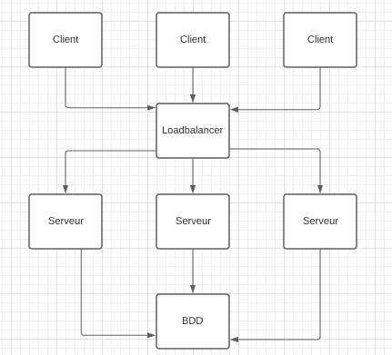

CONCEPTION MICRO SERVICES

1. Une architecture micro service capable de passer à l'échelle serait la suivante avec plusieurs serveurs et un loadbalancer pour pouvoir répartir la charge entre les serveurs.

  

2. En sachant que les jeux de lotterie en ligne doivent tourner 21ℎ/24ℎ et 6𝑗/7𝑗, on effectue le calcul suivant pour trouver le coût si on s'execute dans une VM à 0.00065$/ℎ:
0.00065\*21\*6\*52 = 4.2588$ pour 1 an
Attention 4.2588$/an est le coût pour un seul microservice, il faudrait multiplier ce montant par le nombre de microservices.

3. Dans l'architecture modélisée en question 1, le loadbalancer peut représenter un goulot d'étranglement car toutes les requêtes passent par ce même composant. La base de donnée peut elle aussi représenter un goulot d'étranglement pour la même raison : elle est solicitée à chaque nouvelle requête.

4. La base de données pourrait bénéficier de la réplication pour que l'application ne soit pas impactée si celle ci ne fonctionnais plus.

DEPLOIEMENT AVEC DES CONTAINERS

1. Par manque de temps et n'ayant pas réussit à l'utiliser dans le projet je vais faire le choix de ne pas utiliser de base de donnée et d'utiliser plutôt des tableaux qui seront remis à zéro à chaque arrêt et nouvelle exécution de l'application, ce qui ne devrait pas empêcher d'afficher le tableau récapitulatif en fin de partie.
Je crée donc deux dossiers: un pour le serveur et un pour le client ce qui me permettra de pouvoir les dupliquer par la suite.

Pour le coté serveur je fais le choix d'utiliser un serveur express car c'est celui vu en cours et celui avec lequel je me suis entrainée. --> commande "npm install express" dans les dossiers serveur et client

2. On ajoute les dockerfile pour les deux dossiers:
- Pour lancer le serveur on fait la commande "sudo docker build -t server ." puis la commande "sudo docker run -d -p 3000:3000 server --name serveur1 server " en se plaçant dans le dossier serveur
- Pour lancer un client on fait la commande "sudo docker build -t client ." puis la commande "sudo docker run -d -p 3000:3000 --name client1 client"

